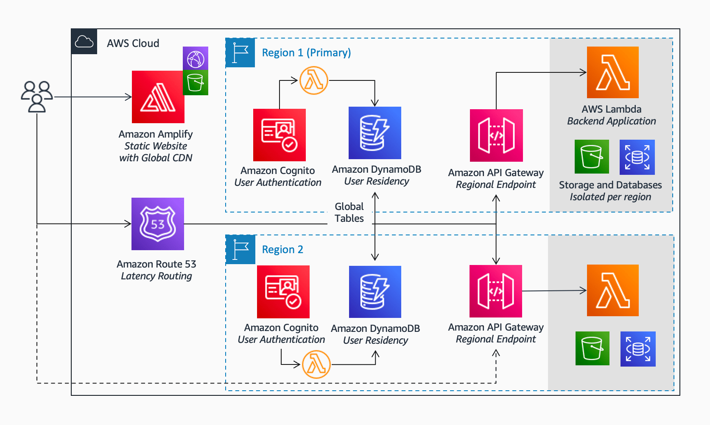

# Building a multi-region architecture with data residency 

This repository demonstrates how to deploy a multi-region architecture with data residency for sensitive data, such as Personally Identifiable Information (PII) or Personal Health Information (PHI) data. To maintain data residency for each region, the architecture operates under a [silo model](https://docs.aws.amazon.com/wellarchitected/latest/saas-lens/silo-pool-and-bridge-models.html) with its own infrastructure stack per region. The architecture is suitable for businesses interested in isolating customer PII/PHI data to a specific region, expanding globally from a single-region architecture, and/or operating in strict regulatory or compliance environments. 

For more details, see [Video: Architectures to Scale Your Startup to Multiple Regions](https://www.twitch.tv/awsonair/video/1851203333).

## Solution Overview 



### Prerequisites

- An [AWS account](https://portal.aws.amazon.com/billing/signup#/start)
- Installed and authenticated [AWS CLI](https://docs.aws.amazon.com/en_pv/cli/latest/userguide/cli-chap-install.html) (authenticate with an [IAM](https://docs.aws.amazon.com/IAM/latest/UserGuide/getting-started.html) user or an [AWS STS](https://docs.aws.amazon.com/STS/latest/APIReference/Welcome.html) Security Token)
- Installed and setup [AWS Cloud Development Kit (AWS CDK)](https://docs.aws.amazon.com/cdk/latest/guide/getting_started.html)
- Installed Node.js, TypeScript and git

### Let’s get you started

#### 1. Make sure you completed the prerequisites above and cloned this repo.

```
git clone git@github.com:aws-samples/multi-region-data-residency
```

#### 2. Open the repository in your preferred IDE and familiarize yourself with the structure of the project.

```
.
├── cdk             CDK code that defines our environment
├── img             Architecture image
└── src
    └── lambda      Handler code of the lambda functions
    └── app         Demo react app 
```

#### 3. Install dependencies

node.js dependencies are declared in a `package.json`.
This project contains a `package.json` file in two different folder: 
- `cdk`: Dependencies required to deploy your stack with the CDK
- `src`: Dependencies required for the Lambda function, i.e. TypeScript types for AWS SDK 

Navigate to each of the folders and run `npm install`

#### 4. Configure your stack (optional)

Open `cdk/bin/multi-region-app.ts` and adjust the parameters to deploy the application. This includes the regions to deploy and creating a Route53 Hosted Zone.

```
// List of Region codes to deploy the application to
const regionsToDeploy = ['us-west-1', 'ap-southeast-2'];
```

#### 5. Deploy your application

Navigate to the `src/app` folder and build the react app to static files using:

```
npm run build 
```

When ready to deploy, navigate to the `cdk` folder and run the following commands. 

`cdk synth` will synthesize a CloudFormation template from your CDK code. If you haven't worked with CDK in your account before, you need to [bootstrap](https://docs.aws.amazon.com/cdk/v2/guide/bootstrapping.html) the required resources for the CDK with `cdk bootstrap`, otherwise skip this step. Note that bootstrapping needs to be performed in every Region you plan to deploy to. You can then deploy the template with `cdk deploy`. 

```
cdk synth 
# replace account id and Region codes (us-east-1 required for SSL certificate)
cdk bootstrap 123456789012/us-east-1 123456789012/us-west-1 123456789012/ap-southeast-2 
cdk deploy --all
```

#### 6. Test the application

Connect to the test application and login using sample users:

```

```

Logging in 

## Cleaning up

When you are done, make sure to clean everything up.

Run the following command to shut down the resources created in this workshop.

```
cdk destroy --all
```

## Security

See [CONTRIBUTING](CONTRIBUTING.md#security-issue-notifications) for more information.

## License

This library is licensed under the MIT-0 License. See the LICENSE file.
