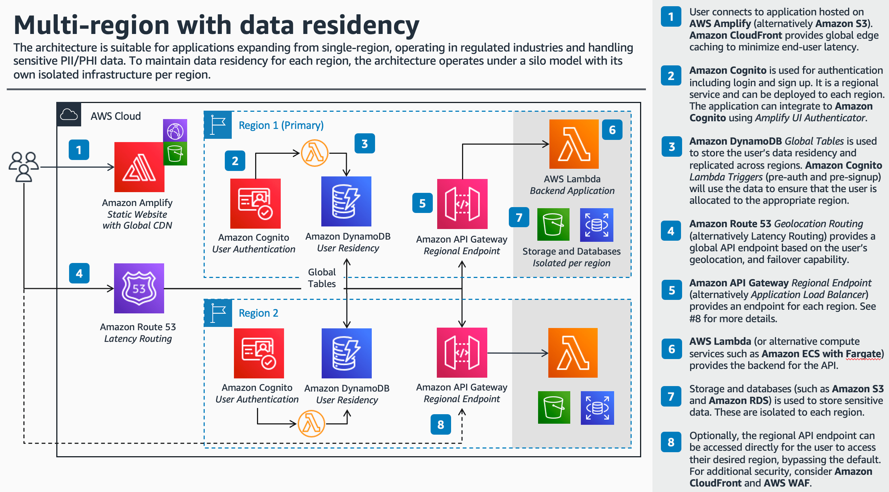

# Building a multi-region architecture with data residency 

This repository demonstrates how to deploy a multi-region architecture with data residency for sensitive data, such as Personally Identifiable Information (PII) or Personal Health Information (PHI) data. To maintain data residency for each region, the architecture operates under a [silo model](https://docs.aws.amazon.com/wellarchitected/latest/saas-lens/silo-pool-and-bridge-models.html) with its own isolated infrastructure stack per region.

The architecture is suitable for businesses in specific verticals such as Health-care / Life-sciences (HCLS) and FinTech, with business requirements to isolate customer PII/PHI data to a specific region, expanding globally from a single-region architecture, and/or operating in strict regulatory or compliance environments.

For more details, see [Video: Architectures to Scale Your Startup to Multiple Regions](https://www.twitch.tv/awsonair/video/1851203333).

## Solution Overview 



### Prerequisites

- An [AWS account](https://portal.aws.amazon.com/billing/signup#/start)
- Installed and authenticated [AWS CLI](https://docs.aws.amazon.com/en_pv/cli/latest/userguide/cli-chap-install.html) (authenticate with an [IAM](https://docs.aws.amazon.com/IAM/latest/UserGuide/getting-started.html) user or an [AWS STS](https://docs.aws.amazon.com/STS/latest/APIReference/Welcome.html) Security Token)
- Installed and setup [AWS Cloud Development Kit (AWS CDK)](https://docs.aws.amazon.com/cdk/latest/guide/getting_started.html)
- Installed Node.js, TypeScript and git

### Let’s get you started

#### 1. Make sure you completed the prerequisites above and cloned this repo.

```
git clone git@github.com:aws-samples/multi-region-data-residency
```

#### 2. Open the repository in your preferred IDE and familiarize yourself with the structure of the project.

```
.
├── cdk             CDK code that defines our environment
├── assets          
    └── images      Image assets
└── src
    └── lambda      Handler code of the lambda functions
    └── app         Demo react app 
```

#### 3. Install dependencies

The node.js dependencies are declared in a `package.json`.
This project contains a `package.json` file in two different folders:

- `cdk`: Dependencies required to deploy your stack with the CDK
- `src`: Dependencies required for the Lambda function, i.e. TypeScript types for AWS SDK 

Install the required dependencies:

```
cd cdk && npm install
cd ..
cd src && npm install
```

#### 4. Create Route53 hosted zone

Before deploying the stack, a domain-name must be configured in Amazon Route 53 which will be used to configure the CDK stack and related sub-domains for the multi-region deployment.

For testing purposes a new domain can be registered, alternatively you can use an existing domain-name provisioned within your AWS Account, or create a new sub-domain with delegated NS records to Route 53 (e.g myapp.startup.com as a new Public Hosted zone).


Note the `Hosted zone ID` which will be used in the following step.

#### 5. Configure environment settings

Before deploying the CDK stack the following environment variables need to be defined.

Regions - Define which regions to deploy the multi-region stack, by default we will deploy to the ap-southeast-2 (Sydney), us-east-2 (Ohio) and eu-west-1 (N. California) for the demonstration.

```
export REGIONS="ap-southeast-2, us-east-1, eu-west-1"
```

Hosted Zone Id - Specify the hosted zone ID from step 4

```
export HOSTEDZONEID="Z2938XXZZZ"
```

Site Domain - Specify the root domain which will be used (e.g mystartup.com)

```
export SITEDOMAIN="mystartup.com"
```

AWS Account ID -- Specify the primary AWS Account ID which will be used to deploy the stack

```
export CDK_DEFAULT_ACCOUNT="YOUR_AWS_ACCOUNT_ID"
```

#### 5. Deploy static web-application

Navigate to the `src/app` folder and build the static React app using:

```
npm run build 
```

When ready to deploy, navigate to the `cdk` folder and run the following commands. 

`cdk synth` will synthesize a CloudFormation template from your CDK code. If you haven't worked with CDK in your account before, you need to [bootstrap](https://docs.aws.amazon.com/cdk/v2/guide/bootstrapping.html) the required resources for the CDK with `cdk bootstrap`, otherwise skip this step. Note that bootstrapping needs to be performed in every Region you plan to deploy to. You can then deploy the template with `cdk deploy`. 

```
cdk synth 
# replace account id and Region codes (us-east-1 required for SSL certificate)
cdk bootstrap $CDK_DEFAULT_ACCOUNT/us-east-1 $CDK_DEFAULT_ACCOUNT/eu-west-1 $CDK_DEFAULT_ACCOUNT/ap-southeast-2 
cdk deploy --all
```

#### 6. Test the application

Connect to the test application e.g. `frontend.mystartup.com` and login using sample users:

```

```

The frontend should be connected to the regional backend API on `app.mystartup.com`.

## Cleaning up

When you are done, make sure to clean everything up.

Run the following command to shut down the resources created in this workshop.

```
cdk destroy --all
```

There may also some resources that will need to be deleted manually (such as the DynamoDB Global Table).

## Security

See [CONTRIBUTING](CONTRIBUTING.md#security-issue-notifications) for more information.

## License

This library is licensed under the MIT-0 License. See the LICENSE file.
